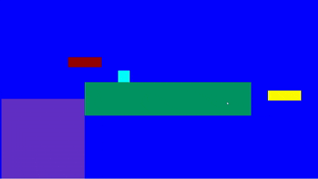

# 2D Game Engine

A lightweight 2D game engine written in **C++17** with multiplayer support via SDL2 and ZeroMQ.
Built as a graduate course project, now being actively developed toward professional standards.

> **Status:** Early development — core loop, rendering, physics, and networking work.
> Actively being refactored and extended.

<p align="center">
  
</p>

---

## Features

- Rectangle-based entity rendering via SDL2
- Entity management with movement, collision, and gravity
- Event-driven architecture (collision, control, death, boundary handlers)
- Peer-to-peer multiplayer via ZeroMQ
- Dynamic proportional window scaling
- Timeline system with pause, speed control, and anchor support
- Sample games: Bubble Shooter, Space Invader prototype

---

## Roadmap

- [ ] Entity Component System (ECS) refactor
- [ ] Sprite and texture rendering
- [ ] Scene management
- [ ] Tilemap support
- [ ] Asset manager
- [ ] Box2D physics integration
- [ ] Lua scripting layer
- [ ] Dear ImGui debug overlay

---

## Project Structure
```
2D-Game-Engine/
├── include/              # All engine headers
├── src/
│   ├── core/             # Entity, EventManager, Game loop, Timeline
│   ├── handlers/         # Collision, Control, Death, SideBoundary handlers
│   ├── modules/          # Gravity, Movement, Platform, Spawnpoint, SideBoundary
│   ├── networking/       # Peer-to-peer via ZeroMQ
│   └── rendering/        # SDL2 renderer + dynamic scaling
├── main.cpp              # Sample game entry point (Bubble Shooter)
├── CMakeLists.txt        # Cross-platform build system
├── .clang-format         # Code style (Google C++ style, 4-space indent)
└── .vscode/              # VS Code tasks, settings, extension recommendations
```

---

## Building & Running

### Prerequisites

| Dependency | Version | macOS | Linux (apt) | Windows |
|---|---|---|---|---|
| C++ compiler | C++17+ | Xcode CLT: `xcode-select --install` | `sudo apt install g++` | MSVC 2019+ or MinGW |
| CMake | 3.16+ | `brew install cmake` | `sudo apt install cmake` | [cmake.org](https://cmake.org/download/) |
| SDL2 | 2.x | `brew install sdl2` | `sudo apt install libsdl2-dev` | [libsdl.org](https://www.libsdl.org) |
| ZeroMQ | 4.x | `brew install zeromq` | `sudo apt install libzmq3-dev` | `vcpkg install zeromq` |
| cppzmq | any | `brew install cppzmq` | `sudo apt install libcppzmq-dev` | `vcpkg install cppzmq` |
| Boost | 1.70+ | `brew install boost` | `sudo apt install libboost-dev` | `vcpkg install boost` |

## Building

**First time setup (run once):**
```bash
# macOS / Linux
./scripts/setup.sh

# Windows (PowerShell as Administrator)
powershell -ExecutionPolicy Bypass -File scripts/setup.ps1
```

**Every build after that:**
```bash
cmake -B build
cmake --build build -j$(nproc 2>/dev/null || sysctl -n hw.logicalcpu)
./build/bin/nova2d_game
```

### VS Code

Open the repo folder — you'll be prompted to install recommended extensions.
- **Build:** `Cmd/Ctrl+Shift+B`
- **Build & Run:** `Cmd/Ctrl+Shift+P` → "Tasks: Run Test Task"

---

## Controls (Bubble Shooter)

| Key | Action |
|---|---|
| Arrow Keys | Move player |
| Spacebar | Shoot |
| P | Pause / unpause |
| T | Toggle scaling mode |
| 1 / 2 / 3 | Change game speed |
| S + H | Shrink player temporarily |
| Double-tap arrow | Quick teleport |

---

## Contributing

1. Fork the repo and create a feature branch: `git checkout -b feature/your-feature`
2. Follow the existing code style — clang-format runs automatically on save
3. Build with `-Wall` and ensure zero warnings before submitting a PR
4. Open a pull request with a clear description of what changed and why

---

## Credits

- [SDL2](https://www.libsdl.org/) — rendering and input
- [ZeroMQ](https://zeromq.org/) — peer-to-peer networking
- [Boost](https://www.boost.org/) — property tree and utilities

Licensed under [GNU GPL v2](LICENSE).